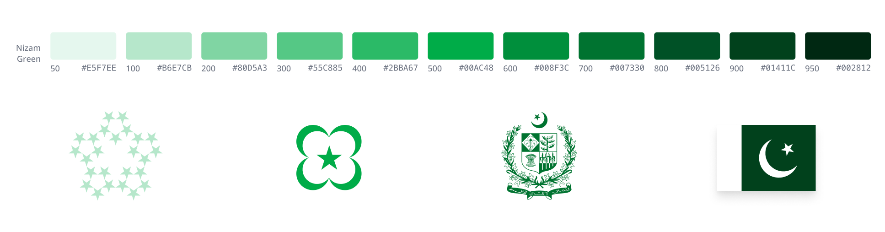

Nizam Green is a custom color set that is used to represent the Pakistani identity. It is a bright and modern take on the traditional green used in most of Pakistani symbology.

Quick tip: the `900` shade of Nizam Green is the same green used in the Pakistani flag.

