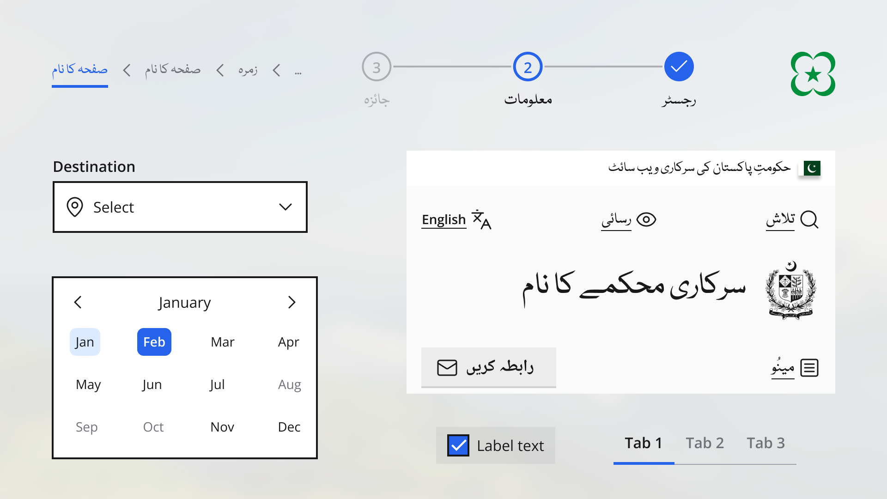

Currently only Figma components are available. Web and mobile components are in progress and will be launched soon. 

To access the Figma components, please visit the [Figma UI kit](https://www.figma.com/community/file/1234567890) and duplicate the file to your own workspace.

## Available components

- Breadcrumbs
- Button
- Card
- Checkbox
- Date Picker
- Footer
- Header
- Input
- Menu
- Progress Steps
- Quick links
- Radio Button
- Table
- Tabs
- Various Identity Commponents
- Vertical Steps