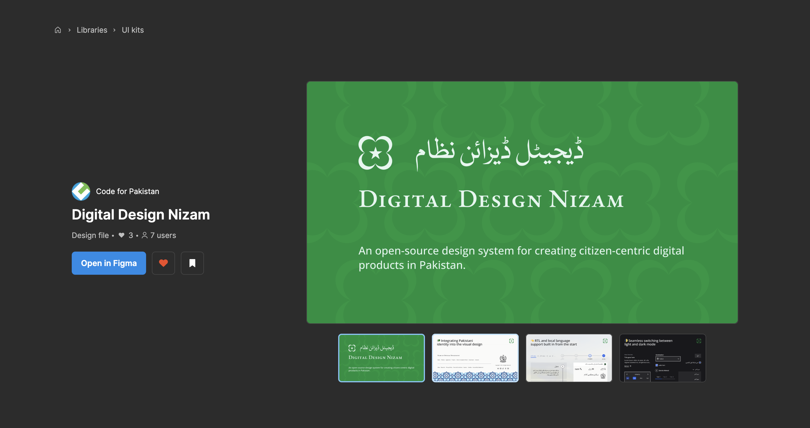
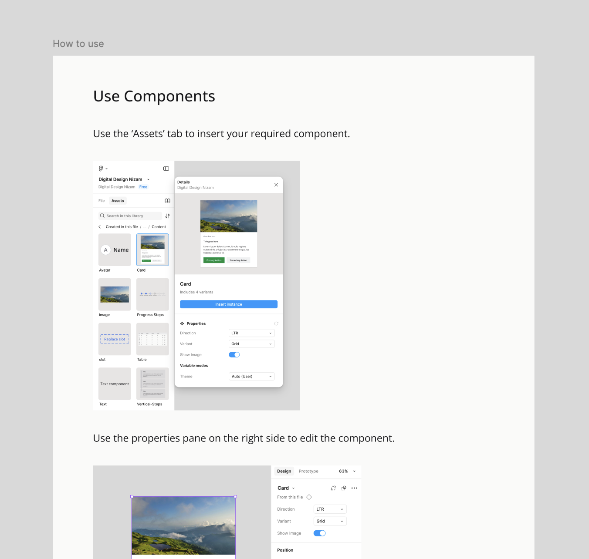

Learn how to put together designs using Digital Design Nizam.

## Figma Community File

Grab the latest version of Digital Design Nizam from the Figma Community page

*Latest version: 0.01*

import { LinkCard } from '@astrojs/starlight/components';

<LinkCard title="Go to Community File" href="https://www.figma.com/community/file/1482387367317205847/digital-design-nizam"  target="_blank" />

## Set up the design system

### For Free Figma Users

It is recommended that you create your designs inside this design system file. This way all the components and style will be available to you by default.

1. Grab the latest version of Digital Design Nizam from the Figma Community page.

2. Create a new page for your designs and move it to the top.

3. Use the ‘How to use’ instructions on the Figma file.

### For Paid Figma Users

1. Add this file to your Figma project folder

2. Go to ‘Assets’ tab

3. Click on ‘Libraries’

4. Add Digital Design Nizam to your libraries by clicking ‘Publish this file’

5. Go to your design file and navigate to ‘Libraries’

6. Find Digital Design Nizam and click ‘Add to file’

All components and styles will be available now in your design file.

## Install fonts

You must have the default fonts installed on your system.

**Open Sans** (sans)

https://fonts.google.com/specimen/Open+Sans

**EB Garamond** (sans serif)

https://fonts.google.com/specimen/EB+Garamond

**Nafees Naskh** (naskh)

https://urdulabs.com/fonts/nafees-naskh-v2.01

**Gulzar** (nastaliq)

https://fonts.google.com/specimen/Gulzar

## Further Instructions

The Figma file for Digital Design Nizam contains more instructions on how to use the Figma file to put together designs.

