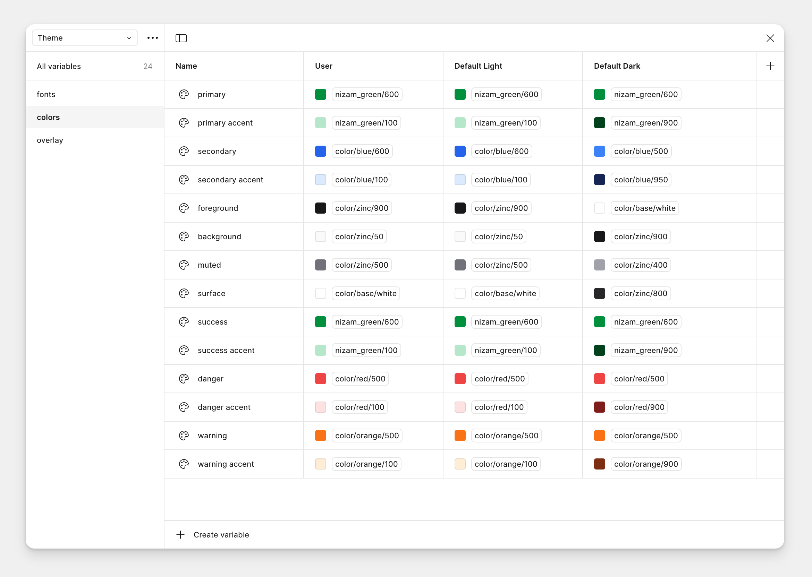

Digital Design Nizam uses stock Tailwind color as well as a custom color set called 'Nizam Green'. 

Nizam Green reflects the Pakistani identity with a modern bright take on the traditonal green used in most of Pakistani symbology.

Quick tip: the `800` shade of Nizam Green is the same green used in the Pakistani flag.

## Usage in Figma 

There are 3 default variable modes for colors: User, Default light and Default dark. 

You may customize your theme colors by editing the 'User' mode, which is same as the Default light mode. 

All colors include the custom 'Nizam Green' color set and stock Tailwind colors.

## Usage in Web

### Theme colors

Default values included in the `theme.css` file. To customize, edit the color variables in the `theme.css` file. 

You can use the following theme colors using Tailwind class prefixes of `color-` and `bg-`. RGB values are used instead of Hex values because of limitation of Tailwind 3.4.

Corresponding dark mode values are updated automatically when the attribute of `data-theme="dark"` is applied to the page or `class="dark"` is applied to an element.

    

        

        

            Primary
            rgb: 0 143 60
            <code class="text-xs mt-0">class="bg-primary"</code>
        

    

    

        

        

            Primary Accent
            rgb: 182 231 203
            <code class="text-xs mt-0">class="bg-primary_accent"</code>
        

    

    

        

        

            Secondary
            rgb: 37 99 235
            <code class="text-xs mt-0">class="bg-secondary"</code>
        

    

    

        

        

            Secondary Accent
            rgb: 219 234 254
            <code class="text-xs mt-0">class="bg-secondary_accent"</code>
        

    

    

        

        

            Foreground
            rgb: 24 24 27
            <code class="text-xs mt-0">class="bg-foreground"</code>
        

    

    

        

        

            Background
            rgb: 250 250 250
            <code class="text-xs mt-0">class="bg-background"</code>
        

    

    

        

        

            Surface
            rgb: 255 255 255
            <code class="text-xs mt-0">class="bg-surface"</code>
        

    

    

        

        

            Muted
            rgb: 113 113 122
            <code class="text-xs mt-0">class="bg-muted"</code>
        

    

    

        

        

            Success
            rgb: 0 143 60
            <code class="text-xs mt-0">class="bg-success"</code>
        

    

    

        

        

            Success Accent
            rgb: 182 231 203
            <code class="text-xs mt-0">class="bg-success_accent"</code>
        

    

    

        

        

            Danger
            rgb: 239 68 68
            <code class="text-xs mt-0">class="bg-danger"</code>
        

    

    

        

        

            Danger Accent
            rgb: 254 226 226
            <code class="text-xs mt-0">class="bg-danger_accent"</code>
        

    

    

        

        

            Warning
            rgb: 249 115 22
            <code class="text-xs mt-0">class="bg-warning"</code>
        

    

    

        

        

            Warning Accent
            rgb: 255 237 213
            <code class="text-xs mt-0">class="bg-warning_accent"</code>
        

    

### All colors

You can also use all of Tailwind's stock colors by applying class names such as `bg-blue-500` or `text-red-600`. Visit Tailwind's documentation page on colors to learn more.

import { LinkCard } from '@astrojs/starlight/components';

<LinkCard title="Tailwind colors" href="https://v3.tailwindcss.com/docs/customizing-colors"  target="_blank" />
